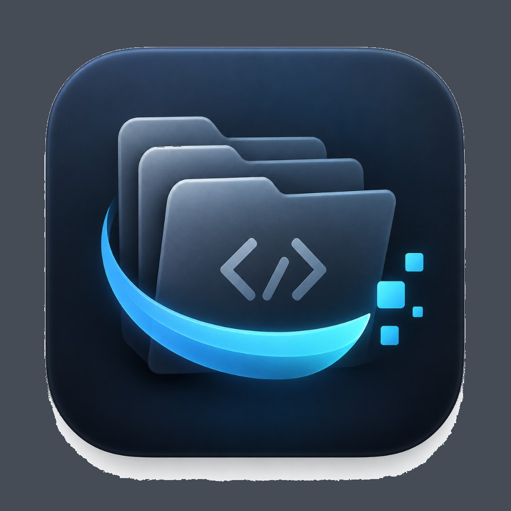
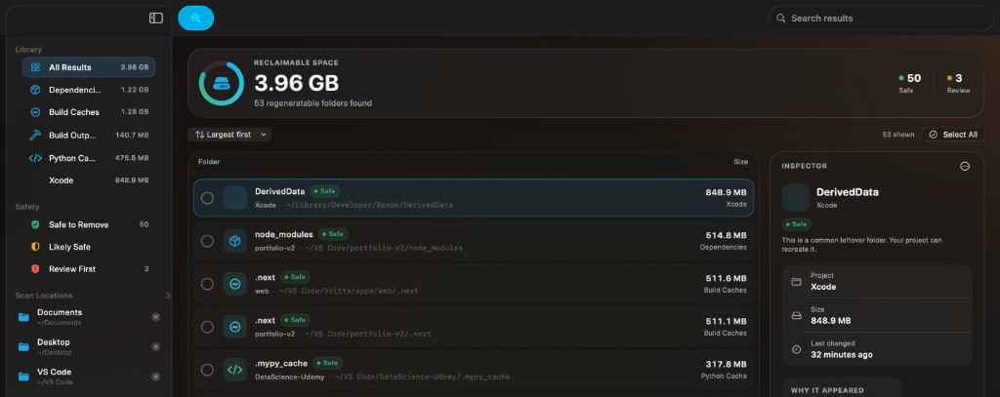

<p align="center">
  
</p>

<h1 align="center">DevSweep</h1>

<p align="center">
  Reclaim disk space from regeneratable developer files — safely and transparently.
</p>

<p align="center">
  <a href="https://github.com/harshsinha-12/dev-sweep/actions/workflows/ci.yml">
    
  </a>
  
  
  <a href="LICENSE">
    
  </a>
</p>



DevSweep is a native macOS utility that finds dependency folders, build caches, test output, and other files your development tools can recreate. It shows what is using space, explains why each folder was detected, and moves only the items you approve to the macOS Trash.

No subscriptions. No telemetry. No vague “system cleanup.”

## Features

- Native SwiftUI interface with Liquid Glass materials
- Configurable scan locations
- Asynchronous, cancellable scanning
- Folder-size calculation with progressive results
- Search, category filters, safety filters, and sorting
- Clear detection reasons and safety classifications
- Multi-select cleanup with a final review screen
- Finder reveal, path copying, and ignore rules
- Cleanup through macOS Trash instead of permanent deletion
- Persistent preferences and scan locations

## Supported developer files

DevSweep currently recognizes:

- JavaScript and TypeScript: `node_modules`, `.next`, `.nuxt`, `.turbo`, `.parcel-cache`, `.svelte-kit`
- Python: `__pycache__`, `.pytest_cache`, `.mypy_cache`, `.ruff_cache`, `.venv`, `venv`
- Rust: `target` when a `Cargo.toml` is present
- Xcode: `DerivedData`
- General project output: `dist`, `build`, `out`, `.cache`
- Test output: `coverage`

Generic names such as `build`, `out`, and `.cache` require supporting project evidence and receive a more cautious classification.

## Requirements

- macOS 26 or later
- Apple Silicon or Intel Mac

## Install

### Download a release

1. Open the [latest DevSweep release](https://github.com/harshsinha-12/dev-sweep/releases/latest).
2. Download `DevSweep-v<version>.dmg`.
3. Open the disk image.
4. Drag **DevSweep** into **Applications**.
5. Open DevSweep from Applications or Launchpad.

Early releases may be unsigned. If Gatekeeper blocks the first launch:

1. Right-click **DevSweep** in Applications and choose **Open**.
2. Confirm by selecting **Open** again.
3. If necessary, use **System Settings → Privacy & Security → Open Anyway**.

Only download builds published from this repository.

### Build from source

Building requires Xcode 26 or later and [XcodeGen](https://github.com/yonaskolb/XcodeGen).

```bash
git clone https://github.com/harshsinha-12/dev-sweep.git
cd dev-sweep
brew install xcodegen
xcodegen generate
open DevSweep.xcodeproj
```

Select the **DevSweep** scheme and press **⌘R**.

## Usage

1. Add folders containing your projects from the **Scan Locations** section.
2. Select **Scan Now** or press **⌘R**.
3. Search, sort, or filter the detected folders.
4. Select individual folders or use **Select All** for the visible results.
5. Open the inspector to review the size, location, detection reason, and safety status.
6. Select **Review Cleanup**.
7. Confirm the exact folders and total size, then choose **Move to Trash**.

Items remain recoverable from the macOS Trash.

### Safety classifications

- **Safe** — a known generated folder with strong supporting project evidence.
- **Likely Safe** — probably regeneratable, but worth checking for unusual projects.
- **Review First** — a generic or potentially valuable build folder that requires closer review.

### Keyboard shortcuts

- **⌘R** — scan again
- **⌘F** — focus search
- **Space** — toggle the highlighted result
- **⌘,** — open Settings

Right-click a result to reveal it in Finder, copy its path, ignore the folder or project, or move it to Trash.

## Safety model

DevSweep treats path validation as security-critical:

- Cleanup candidates must be recognized generated directories.
- Every path is resolved and validated again immediately before cleanup.
- Candidates must remain inside an approved scan location or known safe cache location.
- Scan roots, project roots, home folders, and system locations are rejected.
- Protected names such as `.git`, package manifests, lockfiles, and source directories are rejected.
- Symbolic links are not followed outside the intended traversal tree.
- One inaccessible folder does not stop the rest of a scan.
- Normal cleanup uses `FileManager.trashItem`; DevSweep does not invoke `rm -rf`.

DevSweep never automatically selects or removes files.

## Permissions

DevSweep scans only locations configured in the sidebar, plus the standard Xcode DerivedData location when available. macOS may require authorization for protected folders. Locations that cannot be read are skipped without stopping the entire scan.

The current GitHub-distributed build is not App Store sandboxed. Filesystem access is isolated behind services so security-scoped access can be added for a future sandboxed distribution.

## Development

Generate the Xcode project after adding or removing source files:

```bash
xcodegen generate
```

Build:

```bash
xcodebuild \
  -scheme DevSweep \
  -project DevSweep.xcodeproj \
  -destination 'platform=macOS' \
  -configuration Debug \
  build
```

Run the test suite:

```bash
xcodebuild \
  -scheme DevSweep \
  -project DevSweep.xcodeproj \
  -destination 'platform=macOS' \
  test
```

### Project structure

```text
DevSweep/
├── App/          Application entry point
├── Models/       Cleanup candidates, categories, confidence, scan state
├── Services/     Detection, scanning, sizing, and Trash operations
├── Stores/       App state and persisted preferences
├── Support/      Formatting and path safety validation
├── Views/        SwiftUI interface and visual system
└── Resources/    Asset catalogs

DevSweepTests/    Detection, scanning, formatting, and safety tests
Scripts/          Local Release and DMG packaging
Marketing/        Reusable screenshots and app artwork
```

Filesystem operations stay outside SwiftUI views. Core services use protocols so scanning and cleanup behavior can be tested independently.

## Packaging

Build an unsigned Release app:

```bash
./Scripts/build-release.sh
```

Create a drag-and-drop DMG and ZIP archive:

```bash
VERSION=0.1.0 ./Scripts/package-dmg.sh
```

Artifacts are written to `dist/`.

The CI workflow builds and tests pushes and pull requests. Pushing a version tag runs the release workflow:

```bash
git tag v0.1.0
git push origin v0.1.0
```

The workflow builds `DevSweep-v0.1.0.dmg`, `DevSweep-v0.1.0.zip`, and an installation note, then attaches them to a GitHub Release.

Signing and notarization are not configured yet. The release pipeline is structured so Developer ID signing, hardened runtime, notarization, and stapling can be added later without changing the app architecture.

## Roadmap

- Developer ID signing and notarization
- Scheduled and automatic scans
- Project-level storage summaries
- Folder-age filters and cleanup suggestions
- Simulator, package-manager, Docker, Android, and Homebrew cache support
- Storage history and analytics
- Menu bar mode
- Homebrew Cask distribution

## Marketing assets

Portfolio-ready assets are stored in [`Marketing/`](Marketing/):

- `devsweep-dashboard.jpg` — current application screenshot
- `devsweep-app-icon.png` — 1024 × 1024 app artwork

Use these files instead of extracting resized assets from `Assets.xcassets`.

## Contributing

Issues and pull requests are welcome. Safety-related changes should include tests covering both accepted cleanup candidates and rejected dangerous paths.

Before submitting a pull request:

1. Regenerate the project with `xcodegen generate`.
2. Build the Debug configuration.
3. Run the full test suite.
4. Confirm that no cleanup path protections were weakened.

## License

DevSweep is available under the [MIT License](LICENSE).
